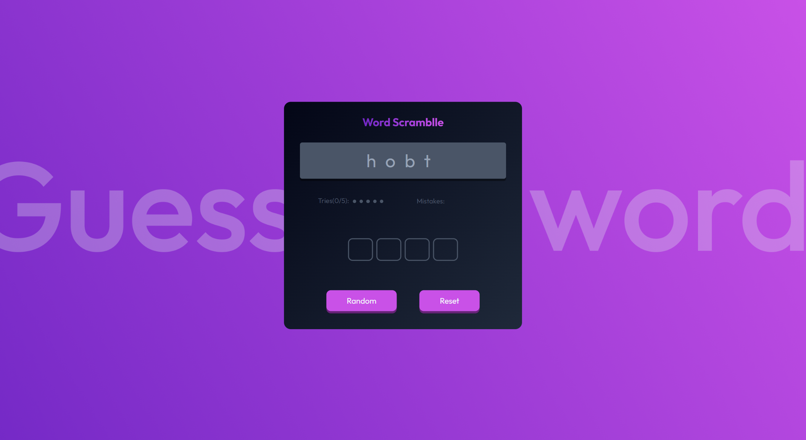
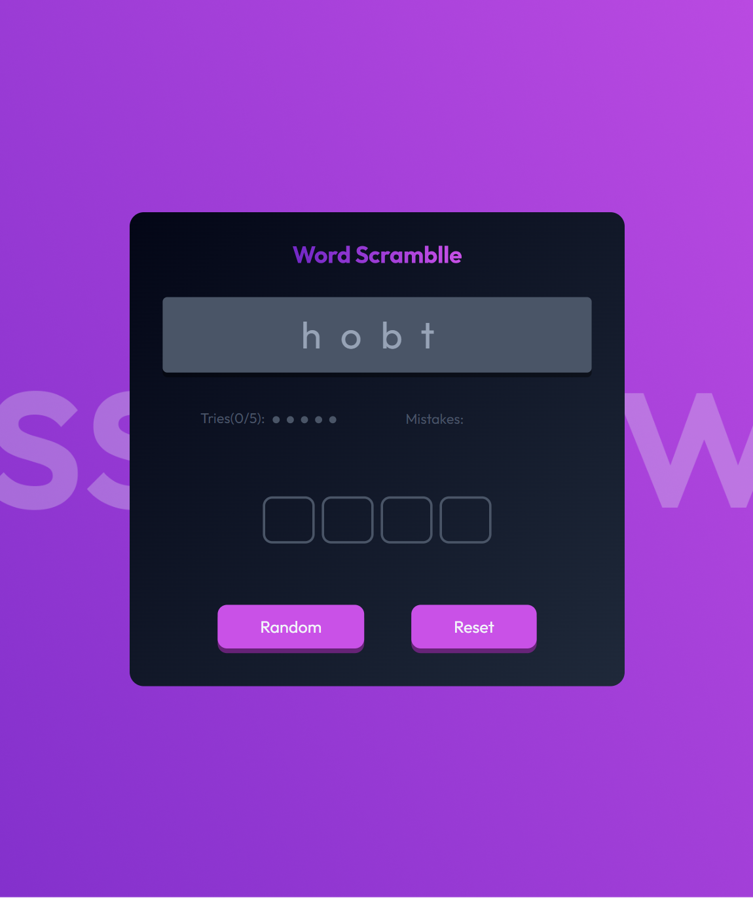

<!-- Please update value in the {}  -->

<h1 align="center">Guess The Word Game</h1>

<div align="center">
   Solution for a challenge from  <a href="http://devchallenges.io" target="_blank">Devchallenges.io</a>.
</div>

<div align="center">
  <h3>
    <a href="https://h-yoshikawa44.github.io/ch-guess-the-word-game/">
      Demo
    </a>
    <span> | </span>
    <a href="https://devchallenges.io/solution/32676">
      Solution
    </a>
    <span> | </span>
    <a href="https://devchallenges.io/challenge/guess-the-word">
      Challenge
    </a>
  </h3>
</div>

<!-- TABLE OF CONTENTS -->

## Table of Contents

- [Table of Contents](#table-of-contents)
- [Overview](#overview)
  - [Desktop](#desktop)
  - [Mobile](#mobile)
  - [Built With](#built-with)
- [Features](#features)
- [How To Use](#how-to-use)
- [learned/improved](#learnedimproved)
- [Acknowledgements](#acknowledgements)
- [Contact](#contact)

<!-- OVERVIEW -->

## Overview

### Desktop



### Mobile



### Built With

<!-- This section should list any major frameworks that you built your project using. Here are a few examples.-->

Base

- [HTML](https://developer.mozilla.org/ja/docs/Web/HTML)
- [CSS](https://developer.mozilla.org/ja/docs/Web/CSS)
- [JavaScript](https://developer.mozilla.org/ja/docs/Web/JavaScript)
- [Node.js](https://nodejs.org/)：20.16.0
- [Vite](https://ja.vitejs.dev/)：5.4.8

Other major libraries

- [Lightning CSS](https://lightningcss.dev/)
- [random-words](https://github.com/apostrophecms/random-words)

## Features

<!-- List the features of your application or follow the template. Don't share the figma file here :) -->

This application/site was created as a submission to a [DevChallenges](https://devchallenges.io/challenges) challenge. The [challenge](https://devchallenges.io/challenge/guess-the-word) was to build an application to complete the given user stories.

- [x] Create a guess the word game that matches the given design.
- [x] Use HTML to create the basic structure.
- [x] Use Vanilla JavaScript to add interactivity.
- [x] Users can see a random scrambled word when the page is first loaded or after users click the random button.
- [x] Users can enter one letter at a time. After each attempt, the input should automatically focus on the next input if it exists.
- [x] Users can see the number of wrong answers (tries) and which answers are wrong (mistakes).
- [x] Users can regenerate a new scrambled word by selecting the random button.
- [x] Users can reset all inputs, mistakes, and tries by selecting the reset button.
- [x] When the number of tries or mistakes reaches 6, the game should be reset.
- [x] When the user completes the game, it should show a '🎉 Success' alert.
- [x] The page should be responsive on different screen sizes.
- [x] Deploy the solution and submit Repository URL and Demo URL.

## How To Use

<!-- Example: -->

To clone and run this application, you'll need [Git](https://git-scm.com) and [Node.js](https://nodejs.org/en/download/) (which comes with [npm](https://www.npmjs.com/)) installed on your computer. From your command line:

```bash
# Clone this repository
git clone https://github.com/h-yoshikawa44/ch-guess-the-word-game.git
# or
git clone git@github.com:h-yoshikawa44/ch-guess-the-word-game.git

# Install dependencies
npm install

# Run the Vite
npm run dev
```

## learned/improved

- Review of JavaScript class syntax.
- How to manage game state by also utilizing classes.
- How to write CSS that looks like you are pressing a button.
- How to make all text selected when focused.

## Acknowledgements

<!-- This section should list any articles or add-ons/plugins that helps you to complete the project. This is optional but it will help you in the future. For exmpale -->

- [MDN - JavaScript - クラス](https://developer.mozilla.org/ja/docs/Web/JavaScript/Reference/Classes)
- [MDN - HTMLInputElement: select() メソッド](https://developer.mozilla.org/ja/docs/Web/API/HTMLInputElement/select)
- [CSSで作る！押したくなるボタンデザイン100（Web用）](https://saruwakakun.com/html-css/reference/buttons)
- [文字列を1文字ずつ配列化（サロゲートペアを考慮）](https://qiita.com/sounisi5011/items/aa2d747322aad4850fe7)

## Contact

- Website：[h-yoshikawa44.com](https://h-yoshikawa44.com)
- GitHub：[@h-yoshikawa44](https://github.com/h-yoshikawa44)
- X：[@yoshi44_lion](https://x.com/yoshi44_lion)
